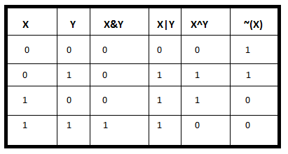
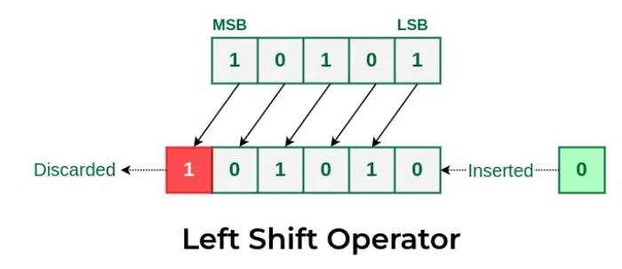
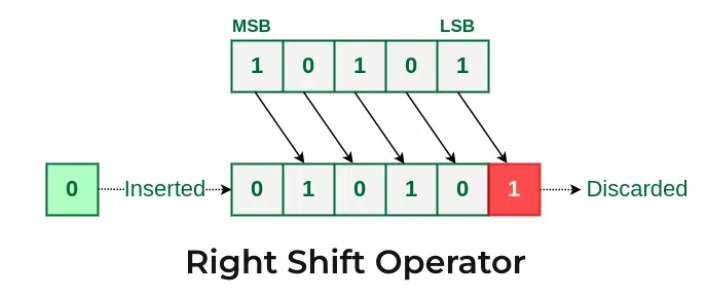

# Ch 16. 비트마스크 & Ch 17. 부분합

> 발표일 `24.07.03`
>
> 발표자 `공병규`

## 비트마스크 (Bitmask)

- 자료구조의 파라미터에 대해서 정수의 2진수 표현을 사용

- 엄밀히 말해서 자료구조나 알고리즘이 아닌 구현 스킬의 일종

### 장점

- 잘 쓰면 더 빠르고, 적은 메모리의 간결한 코드를 작성할 수 있다

- 예를 들어 [True, False, True, ...]와 같은 정해진 길이의 boolean 배열을 다룰 경우
    - 각 위치의 T/F를 1/0으로 나타내면 2진법 정수 하나만으로 오버헤드 없이 다룰 수 있다

### 기본적인 비트 연산들

- AND(&), OR(|), NOT(~), XOR(^)
- SHIFT(<<, >>)



left shift |right shift
:--:|:--:
 | 


> 비트연산의 우선순위를 잘 고려해서 구현해야 함

> 오버플로우에 주의
> > 예 : (1<<35)의 경우 1은 signed integer(32비트)로 취급 -> 0
> > > (1ull)<<35 (ull : unsigned long long(64비트))

### 예시 : 부분집합을 2진법 정수 하나로 대체하기

- 집합 S : `{0,1,2,...n-1}`
- S의 부분집합을 n비트의 2진법 정수로 표현
- (오른쪽부터) i번째 비트가 1이면 원소 i를 포함, 그렇지 않으면 미포함으로 간주
- 34 = 10010 (2) : `{1,4}`
 
  ---

공집합 : 0

전체집합 : (1<<n) -1 = 1111..11

집합 x에 원소 i가 있는지 여부

    (x & (1<<i)) > 0

원소 i 추가

    x | (1<<i)

원소 i 제거

    x -= (1<<i) 또는 x&= ~ (1<<i)

두 집합 a, b에 대해
- 합집합 : a | b
- 교집합 : a & b
- 차집합( a - b ) : a & (~b)

집합의 최소원소 찾기

    x & (-x)

- 원리 : -x = (~x) + 1
- `00010100(LSB 1)00000`
- `11101011(LSB 0)11111`
- `11101011(LSB 1)00000`

- 응용 : 우선순위 큐의 입력 원소 범위가 작을 때 사용 가능

## 부분합

- 정수로 이루어진 배열 A가 존재 (1-indexed)
- 배열의 시작부터 i번째 위치까지의 합을 저장한 배열 S
  - ```cpp
    S[0] = 0;
    S[i] = S[i-1] + A[i];
    ```
- 구간 `[l,r]`의 A의 원소의 합은 `S[r]-S[l-1]`로 표현 가능
- 그냥 더했다면 r-l+1번 반복해야하지만 한번에 계산할 수 있음

### 2차원 확장

- 2차원 배열 A가 존재 (1-indexed)
- 2차원 누적합 배열 `S[x][y]` 
  - (1,1)부터 (x,y)까지의 직사각형 내 A의 합
  - ```cpp
    S를 0으로 초기화

    for(i=1;i<=n;i++)
        for(j=1;j<=m;j++)
            S[i][j]=S[i][j-1]+A[i][j];

    for(j=1;j<=m;j++)
        for(i=1;i<=n;i++)
            S[i][j]=S[i-1][j]+S[i][j];
    ```


- 직사각형 범위 [x1,x2] , [y1,y2] 내의 A의 합
  - ```cpp
        S[x2][y2] - S[x1-1][y2] - S[x2][y1-1] + S[x1-1][y1-1]
    ```


### 예제 : 1차원 배열에서 누적합이 최대인 구간 찾기

https://www.acmicpc.net/problem/1912

- 정수 배열의 연속적 부분배열중 그 부분배열의 원소 합의 최댓값 찾기
- 구간 [l,r]을 다 해보기에는 N이 너무 큼 ( N <= 100,000)
- r을 먼저 고정하고 생각 (l < r)
- 구간합 `S[r]-S[l-1]` 이 최대가 되기 위해서는 `S[l-1]`이 최소가 되어야 함
- `dp[x]` : `min(S[0],S[1], ... S[x])`
- `dp[x] = min(dp[x-1],S[x])`
- `S[r]-dp[r-1]` 로 `[?,r]` 형태 구간들 중 최대 부분합을 알 수 있다

```python
n = int(input())
arr = list(map(int,input().split()))
dp = [0 for _ in range(n + 1)]
sum = [0 for _ in range(n + 1)]
maxsum = -1000

for i in range(1,n + 1):
    sum[i] = sum[i - 1] + arr[i - 1]
    dp[i] = min(sum[i], dp[i - 1])
    maxsum = max(maxsum,sum[i]- dp[i-1])

print(maxsum) 
```

## References

https://www.geeksforgeeks.org/left-shift-right-shift-operators-c-cpp/

https://www.hackerearth.com/practice/basic-programming/bit-manipulation/basics-of-bit-manipulation/tutorial/

https://velog.io/@ohdowon064/Algorithm-2%EC%B0%A8%EC%9B%90-%EB%B0%B0%EC%97%B4-%EB%B6%80%EB%B6%84%ED%95%A9-%EB%88%84%EC%A0%81%ED%95%A9-%EA%B5%AC%ED%95%98%EA%B8%B0

