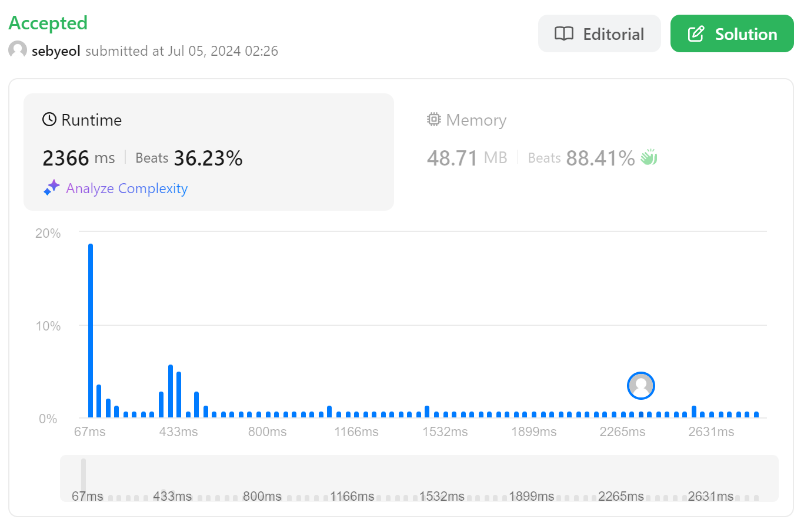
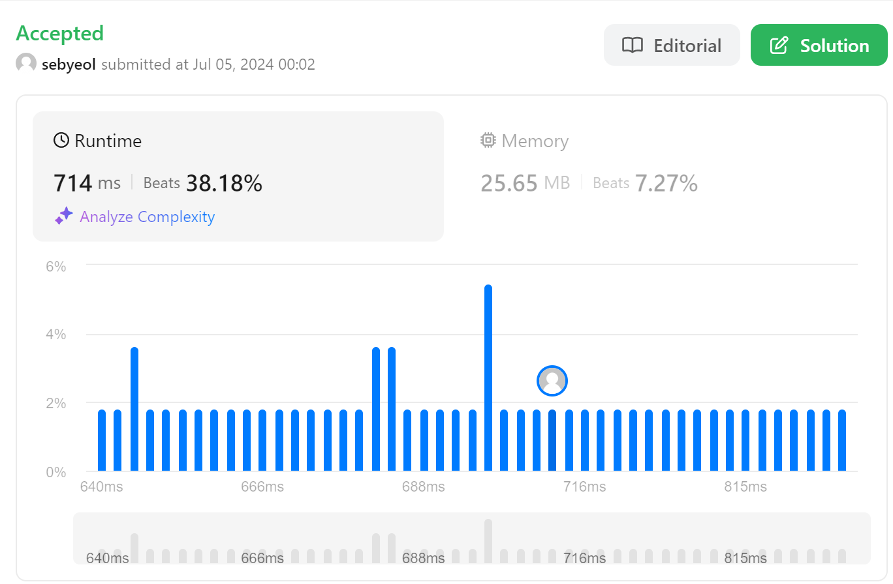

### 698. Partition to K Equal Sum Subsets



```javascript
const canPartitionKSubsets = (nums, k) => {
  const totalSum = nums.reduce(
    (accumulator, currentValue) => accumulator + currentValue,
    0
  );
  if (totalSum % k) return false;

  const targetSum = totalSum / k;

  const func = (index, curSum, isVisited) => {
    if (curSum === targetSum) {
      if (isVisited + 1 === 1 << nums.length) return true;
      return func(0, 0, isVisited);
    }

    if (curSum > targetSum) return false;

    for (let i = index; i < nums.length; i++) {
      if (isVisited & (1 << i)) continue;
      if (func(i + 1, curSum + nums[i], isVisited | (1 << i))) return true;
    }

    return false;
  };

  return func(0, 0, 0);
};
```

### 2256. Minimum Average Difference



```python
class Solution(object):
    def minimumAverageDifference(self, nums):
        length = len(nums)
        sum = [0] * length

        for i in range(length):
            if not i:
                sum[i] = nums[i]
            else:
                sum[i] = sum[i-1] + nums[i]

        avg_diff = [abs(sum[i]//(i+1) - (sum[-1]-sum[i])//(length-i-1 or 1)) for i in range(length)]

        return avg_diff.index(min(avg_diff))
```
