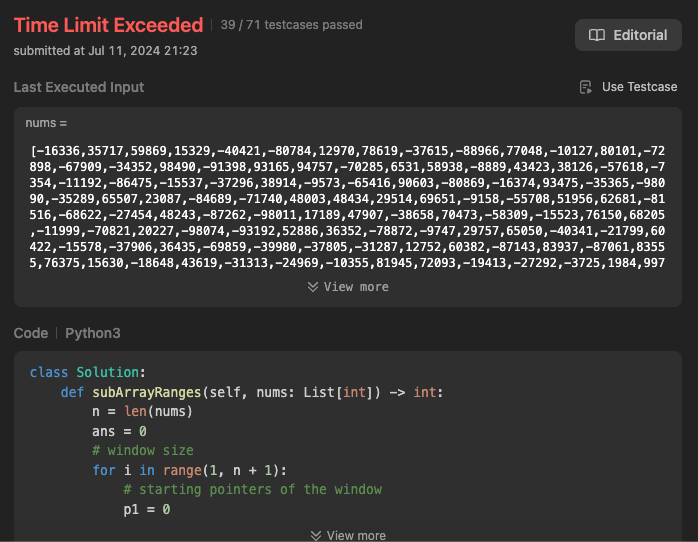

- [2104. Sum of Subarray Ranges](https://leetcode.com/problems/sum-of-subarray-ranges/description/)



```python
class Solution:
    def subArrayRanges(self, nums: List[int]) -> int:
        n = len(nums)
        ans = 0
        # window size
        for i in range(1, n + 1):
            # starting pointers of the window
            p1 = 0
            p2 = i - 1
            while p2 <= n - 1:
                ans += max(nums[p1:p2 + 1]) - min(nums[p1:p2 + 1])
                p1 += 1
                p2 += 1

        return ans

```

- [2762. Continuous Subarrays](https://leetcode.com/problems/continuous-subarrays/description/)


```python
class Solution:
    def continuousSubarrays(self, nums: List[int]) -> int:
        lastseen = dict() # index where value was last seen
        window = set() # window of current values
        result = left = 0
        for i, num in enumerate(nums):
            for x in list(window):
                if abs(num-x) > 2:
                    left = max(lastseen[x]+1, left)
                    window.remove(x)
            lastseen[num] = i
            window.add(num)
            result += i - left + 1
        return result

```
