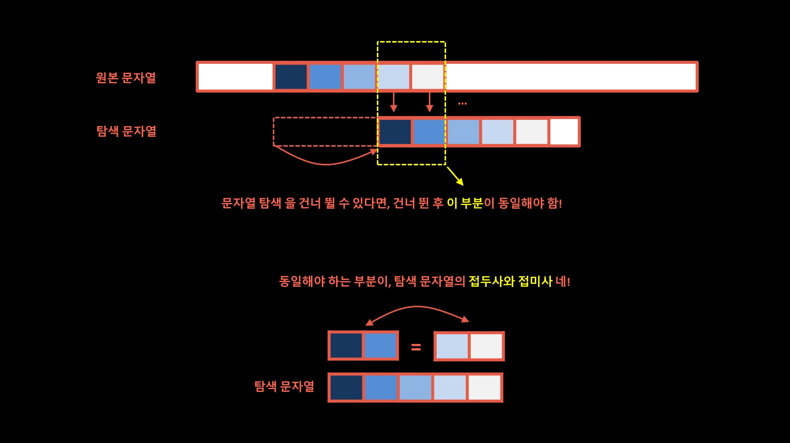
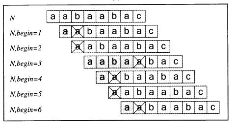
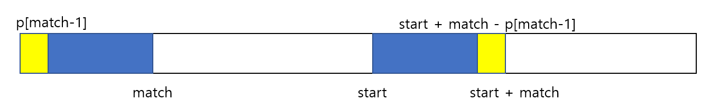
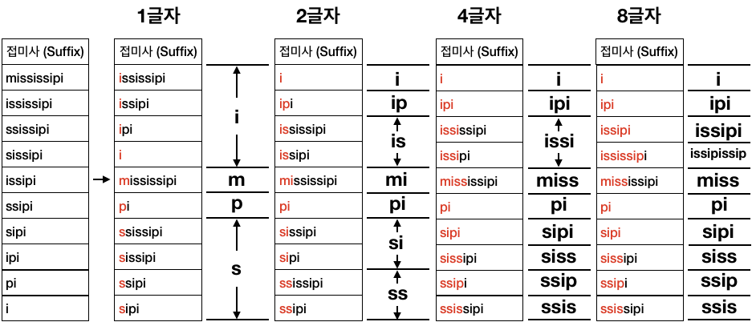

# Ch 20. 문자열

> 발표일 `24.07.17`
>
> 발표자 `안재우`

## 문자열 검색

- 주어진 문자열 A의 substring으로 문자열 B가 존재하는가

### 브루트 포스 알고리즘

- 처음부터 인덱스를 한 칸씩 이동하면서 해당 위치에서 시작하는 길이가 B와 같은 A의 substring이 B와 일치하는지 조사
- 시간 복잡도: `O(|A| * |B|)`

### KMP 알고리즘

- 일치하지 않을때 한 칸씩 이동시키지 않고 몇 칸씩 건너 뛰어서 시간 단축



- 건너 뛴 이후의 시작 부분이 일치하지 않으면 건너 뛰는 의미 없음
  - 현재 겹치는 부분(C)의 접미사 = 건너 뛴 이후의 원본 문자열 A의 시작 부분
  - 현재 겹치는 부분의 접두사 = 탐색 문자열 B의 시작 부분
- 현재 겹치는 부분에서 접두사와 접미사가 동일한 값을 가지는 최대 길이의 접두사 & 접미사 찾기
  - 해당 접미사의 위치로 바로 건너뛰기 가능
  - 건너 뛸 수 있는 거리: `{겹치는 부분의 길이} - {최대 길이의 접미사이면서 접두사인 substring의 길이}`
- 부분 일치 테이블

  - B의 길이 n에 대해서 `0 <= i < n`의 i들에 대해서 각각 B[0:i]의 최대 길이의 접미사이면서 접두사인 substring을 기재
  - ex)
    - `aabaaba`의 문자열 B에 대해서
    - | i   | B[0:i]  | 겹치는 부분의 길이 | B[0:i]의 최대 길이의 접미사이면서 접두사인 substring | 해당 substring의 길이 | 이동 할 수 있는 거리 |
      | --- | ------- | ------------------ | ---------------------------------------------------- | --------------------- | -------------------- |
      | 0   | a       | 1                  | -                                                    | 0                     | 1                    |
      | 1   | aa      | 2                  | a                                                    | 1                     | 1                    |
      | 2   | aab     | 3                  | -                                                    | 0                     | 3                    |
      | 3   | aaba    | 4                  | a                                                    | 1                     | 3                    |
      | 4   | aabaa   | 5                  | aa                                                   | 2                     | 3                    |
      | 5   | aabaab  | 6                  | aab                                                  | 3                     | 3                    |
      | 6   | aabaaba | 7                  | aaba                                                 | 4                     | 3                    |

- 알고리즘 단계:

  1.  부분일치 테이블 만들기
  2.  순회하면서 일치하는 substring 찾기

#### 순회하면서 일치하는 substring들 찾기

```
# string a를 순회하면서 string b와 일치하는 substring이 존재하는 모든 인덱스 반환
vector<int> searchSubstring(string a, string b) {
	vector<int> p = getPartialMatch(b);
	int start = 0; # 현재 비교 시작 위치(a 기준)
	int match = 0; # start를 기준으로 지금까지 비교한 a와 b의 글자 수
	int a_length = a.size();
	int b_length = b.size();
	vector<int> result;

	# start의 위치가 a의 길이 - b의 길이보다 작으면 더이상 케이스 없음
	while (start <= a_length - b_length) {
		if (match < m && a[start + match] == b[match]) {
			# 이번에 비교한것도 맞았으니 match 증가 후 계속 비교 진행
			match += 1;
			# b의 길이만큼 비교했는데 다 같으면 현재 start는 구해야 하는 값들중 하나
			if (match == m) {
				result.push_back(start);
				start += 1;
			}
		}
		else {
			# 겹치는거 없으면 바로 다음으로
			if (match === 0) start += 1;
			else {
				# KMP 알고리즘 쓰는 곳
				# match: 겹치는 길이, p[match - 1]: 동일한 접두사/접미사의 길이
				start += match - p[match - 1];
				# 이미 접두사 만큼 겹치는걸 알고 있으므로 match는 0부터 시작하지 않고 접두사가 끝나는 위치에서 시작
				match = p[match - 1];
			}
		}
	}
	return result
}
```

- 해당 부분의 시간 복잡도: `O(|A|)`

#### 부분일치 테이블 만들기



- 단순 계산: 복제한 문자열을 한칸 씩 평행이동하면서 각 상황의 겹치는 길이의 최대값을 구함
  - 시간복잡도: `O(|B|^2)`



- 최적화: 현재 start에서의 검색이 끝난 뒤 start를 이동할 때 한칸씩만 이동하면 손해 -> 여기서도 KMP를 사용
  - start를 match 보다 적은 칸 만큼 이동시키려면 현재 찾은 접두사/접미사 안의 일치하는 접두사/접미사가 존재 해야함
  - 현재 찾은 접두사/접미사 안의 일치하는 접두사/접미사를 다시 또 찾기
  - 다음 start는 해당 접미사의 시작 위치(`start + match - p[match - 1]`)로 이동

```
vector<int> getPartialMatch(string a) {
	int a_length = a.size();
	vector<int> p(a_length, 0);
	int start = 1;
	int match = 0;

	while (begin < a_length - match) {
		if (a[begin + match] == a[match]) {
			# 현재 위치에서 한 칸씩 길이 늘려가면서 일치하는지 검색
			match += 1;
			p[start + match - 1] = match;
		}
		else {
			if (match == 0) start += 1;
			else {
				# KMP 알고리즘 활용
				begin += match - p[match - 1];
				match = p[match - 1];
			}
		}
	}
	return p;
}
```

- 시간복잡도 `O(|B|)`로 단축

- KMP 알고리즘의 종합적 시간복잡도: `O(|A| + |B|)`

#### 예제: 팰린드롬 만들기

- 팰린드롬: 앞에서 읽는거와 뒤에서부터 읽는게 동일한 문자열
  - ex: noon
- 목표: 주어진 문자열 S에 대해서 S뒤에 문자들을 추가로 붙여서 팰린드롬 생성
- KMP 알고리즘을 통한 해결 방식:

  - 문자열 S를 뒤집은 S'을 만들고, S의 접미사이자 S'의 접두사인 가장 긴 substring a 검색
    - S = b + a, S' = a' + b'
    - a = a'
  - 해당 substring을 제외한 부분을 S 뒤에 붙이면 팰린드롬 A 생성
    - A = b + a + b'
    - A' = (b + a + b')' = b + a' + b' = b + a + b' = A
  - 제일 긴 a를 찾아야 팰린드롬 A가 가장 작음

  ```
  # a의 접미사이자 b의 접두사인 문자열의 최대 길이 구하기
  int maxOverlap(string a, string b) {
  	int a_len = a.size();
  	int b_len = b.size();
  	vector<int> p = getPartialMatch(b);
  	int start = 0;
  	int match = 0;

  	while (start < a_len) {
  		if (match < b_len && a[start + match] == b[match]) {
  			match += 1;
  			# 위의 searchSubstring() 함수에서는 작은 문자열 전체가 일치하는 경우를 검색(b의 길이만큼 문자들이 일치)
  			# 여기서는 a 문자열의 마지막까지 문자들이 일치하는걸 검색
  			if (start + match == a_len) {
  				return match;
  			}
  		}
  		else {
  			if (match == 0) start += 1;
  			else {
  				# KMP
  				start += match - p[match - 1];
  				match = p[match - 1];
  			}
  		}
  	}
  	return 0;
  }
  ```

### 접미사 배열(suffix array)

- 작은 S에 대해서 모든 가능한 접미사를 알파벳 순으로 나열한 표
- 주어진 substring s가 S 안에 존재하는지 찾을때 활용
  - 모든 substring들은 접미사의 접두사
- 정렬된 접미사 배열에서 이진탐색으로 s로 시작하는 접미사가 있는지 검색
- 시간복잡도:
  - 이진탐색 시간복잡도: `O(log(|S|))`
  - 문자열 비교 시간복잡도: `O(|s|)`
  - 총 시간복잡도: `O(|s| * log(|S|))`

#### 접미사 배열의 생성

- 접미사 배열의 예시

  - 문자열 `'redfsw'`
    | 인덱스 | 접미사의 시작 인덱스 | 접미사 |
    | -- | -- | -- |
    | 0 | 2 | `'dfsw'` |
    | 1 | 1 | `'edfsw'` |
    | 2 | 3 | `'fsw'` |
    | 3 | 0 | `'redfsw'` |
    | 4 | 4 | `'sw'` |
    | 5 | 5 | `'w'` |

- 정렬을 어떻게 해야하는가
- Nogada 알고리즘: 문자열 두 개를 각 문자들마다 일일이 비교
  - 시간복잡도: 문자열 끼리 비교하는데 O(N), 정렬하는데 O(NlogN)으로 총 `O(N^2logN)`



- 맨버-마이어스 알고리즘:
  - 접미사들을 처음 i개의 글자를 기준으로 정렬하는것을 i를 2배씩 늘려가며 계속 반복
  - i개의 글자를 기준으로 정렬한 뒤 해당 i개의 글자이 같은 접미사들을 그룹화 하고 그룹들을 정렬후 번호를 매김
    - 서로 다른 그룹들 간 순서 비교 가능
    - 시간 복잡도: O(NlogN)
  - 해당 정보를 토대로 2i의 글자를 기준으로 한 그룹 정렬 정보도 파악 가능
    - 두 접미사가 처음 i개의 글자 안에서 서로 다를경우
      - 현재 그룹 값의 비교로 바로 그룹 순서 파악 가능
    - 같을 경우
      - `S[a:] = S[a:a+i] + S[a+i:]`임을 이용
      - 두 접미사 A, B를 각각 `S[a:]`, `S[b:]`라고 할 때 `S[a+i:]`, `S[b+i:]`의 그룹 값을 비교
      - 비교를 O(1)안에 가능
      - 따라서 i, 2i, 4i, ...일 때 그룹화 정렬이 모두 O(NlogN)이 걸린다
  - 총 시간복잡도:
    - 한 단계의 시간 복잡도: O(NlogN)
    - 단계의 개수: i가 2배씩 증가하니까 O(logN)
    - `O(N(logN)^2)`

#### 예제: 원형 문자열

- 시작과 끝이 없는 원형으로 된 길이 n의 문자열 S가 주어질 때, 해당 문자열을 읽을 수 있는 n가지 방법 중 사전순으로 가장 먼저오는 문자열은 무엇인가
  - 브루트 포스: n개의 가능한 시작점에 대해서 하나씩 문자열을 만들어서 조사
    - 시간복잡도: O(n)이 걸리는 문자열 비교가 n번 있으므로 O(n^2)
  - 접미사 배열 활용하기
    - S를 두 번 이어붙여서 S'생성
    - S를 읽을 수 있는 n가지 방법의 문자열은 모두 S'의 substring
    - 길이가 n보다 긴 모든 S'의 접미사들은 각각 S를 읽을 수 있는 n가지 방법의 문자열 중 하나로 시작
    - 해당 접미사들을 사전 순서로 정렬하면 답을 구할 수 있다
    ```
    int circularRead(string s) {
    	string ss = s + s;
    	# getSuffixArray(): 접미사 배열을 구하는 함수
    	# 각 접미사의 시작 인덱스를 대응하는 접미사들을 사전 순서대로 정렬해서 반환
    	vector<int> v = getSuffixArray(ss);
    	for (int i = 0; i < v.size(); i++) {
    		# 접미사 배열을 순회해서 길이가 s.size()보다 큰 첫 접미사 찾기
    		if (v[i] <= s.size()) {
    			해당 접미사의 위치에서 시작하는 주어진 문자열과 길이가 같은 substring 반환
    			return ss.substr(v[i], s.size());
    		}
    	}
    }
    ```
    - 시간복잡도: 접미사 배열을 계산하는 시간복잡도인 `O(N(logN)^2)`
