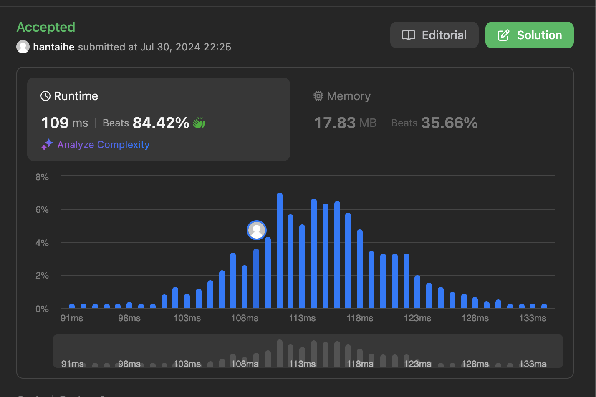
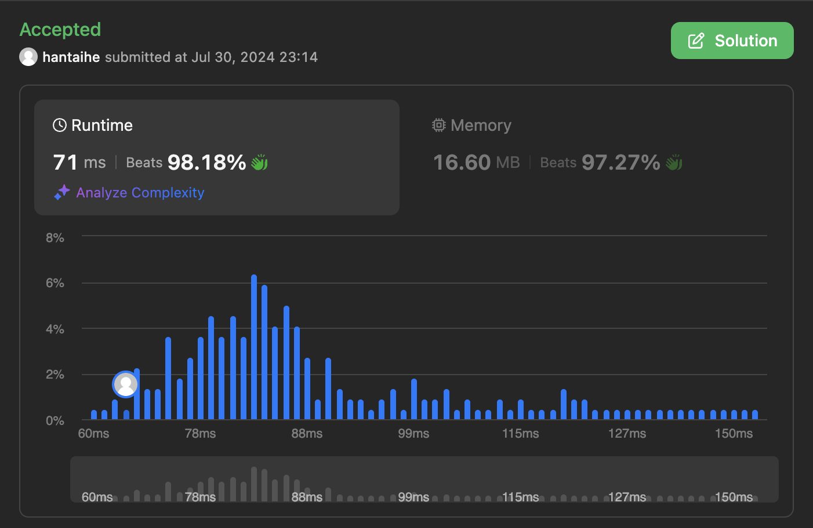

- [690. Employee Importance](https://leetcode.com/problems/employee-importance/description/)


``` python
"""
# Definition for Employee.
class Employee:
    def __init__(self, id: int, importance: int, subordinates: List[int]):
        self.id = id
        self.importance = importance
        self.subordinates = subordinates
"""

class Solution:
    def getImportance(self, employees: List['Employee'], id: int) -> int:
        employeeDic = {employee.id: employee for employee in employees}

        def DFS(id):
            importance = employeeDic[id].importance            
            for subordinateId in employeeDic[id].subordinates:
                importance += DFS(subordinateId)
            return importance
        
        return DFS(id)
        
```

- [1377. Frog Position After T Seconds](https://leetcode.com/problems/frog-position-after-t-seconds/description/)


``` python
class Solution:
    def frogPosition(self, n: int, edges: List[List[int]], t: int, target: int) -> float:
        graph = {i: [] for i in range(1, n + 1)}

        for v, w in edges:
            graph[v].append(w)
            graph[w].append(v)

        queue = deque([(1, t, 1.0)])
        visited = {1}

        while queue:
            current, time, p = queue.popleft()
            neighbors = len(graph[current]) - 1
            if current == 1:
                neighbors += 1

            if current == target:
                if (current == 1 and time > 1) or (neighbors > 0 and time > 0):
                    return 0
                return p

            if time > 0:
                for neighbor in graph[current]:
                    if neighbor not in visited:
                        queue.append((neighbor, time - 1, p / neighbors))
                        visited.add(neighbor)

        return 0
```