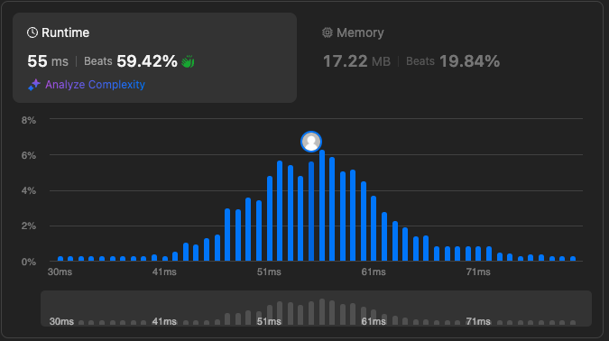

- [684. Redundant Connection](https://leetcode.com/problems/redundant-connection/description/)



```python
from typing import List

class UnionFind:
    def __init__(self, size):
        self.parent = list(range(size))
        self.rank = [1] * size

    def find(self, u):
        if self.parent[u] != u:
            self.parent[u] = self.find(self.parent[u])
        return self.parent[u]

    def union(self, u, v):
        root_u = self.find(u)
        root_v = self.find(v)

        if root_u != root_v:
            if self.rank[root_u] > self.rank[root_v]:
                self.parent[root_v] = root_u
            elif self.rank[root_u] < self.rank[root_v]:
                self.parent[root_u] = root_v
            else:
                self.parent[root_v] = root_u
                self.rank[root_u] += 1
        else:
            return False
        return True

class Solution:
    def findRedundantConnection(self, edges: List[List[int]]) -> List[int]:
        uf = UnionFind(len(edges) + 1)
        for u, v in edges:
            if not uf.union(u - 1, v - 1):
                return [u, v]
```

- [1268. Search Suggestions System](https://leetcode.com/problems/search-suggestions-system/description/)

```python
class Solution:
    def suggestedProducts(self, products: List[str], searchWord: str) -> List[List[str]]:
        products.sort()
        result = []
        prefix = ""

        for char in searchWord:
            prefix += char
            matches = [product for product in products if product.startswith(prefix)]
            result.append(matches[:3])

        return result
```
