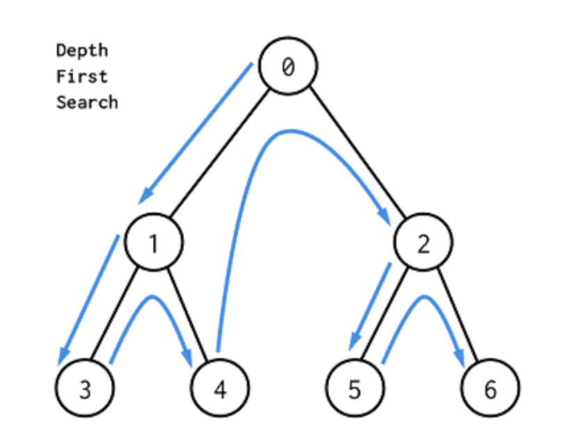
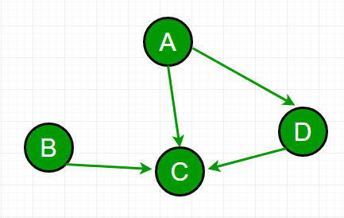
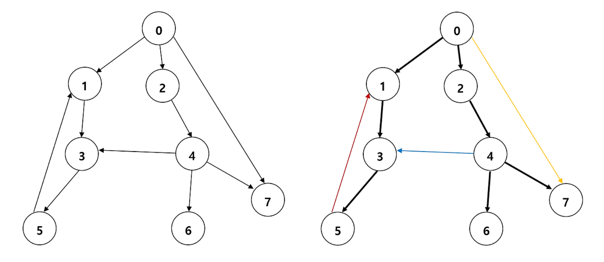
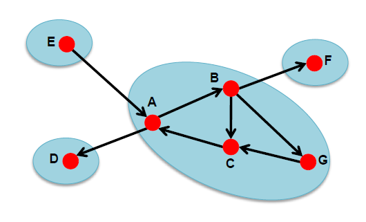
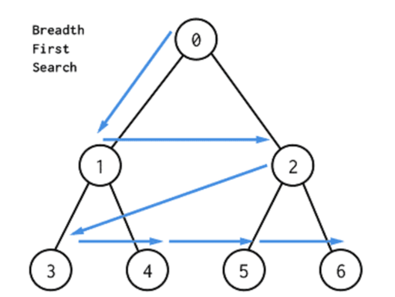

# Ch 28. 그래프의 깊이 우선 탐색 & Ch 29. 그래프의 너비 우선 탐색

> 발표일 `24.08.16`
>
> 발표자 `박근영`

<br/>

## 그래프의 깊이 우선 탐색 (DFS)

> 1. 현재 정점과 인접한 간선들을 하나씩 검사
> 2. 방문하지 않은 정점으로 향하는 간선이 있다면 그 간선을 따라감
> 3. 막힌 정점에 도달하면 따라온 간선을 따라 뒤로 돌아감



<br/>

### 구현

막힌 정점에 도달하면 따라온 간선을 따라 뒤로 돌아감 -> 재귀 호출

```c++
// 그래프의 인접 리스트 표현
vector<vector<int> > adj;
// 각 정점을 방문했는지 여부를 나타낸다.
vector<bool> visited;
// 깊이 우선 탐색을 구현한다.
void dfs(int here) {
    cout << "DFS visits " << here << endl;
    visited[here] = true;
    // 모든 인접 정점을 순회하면서
    for(int i = 0; i < adj[here].size(); ++i) {
        int there = adj[here][i];
        // 아직 방문한 적 없다면 방문한다.
        if(!visited[there])
            dfs(there);
    }
    // 더이상 방문할 정점이 없으니, 재귀 호출을 종료하고 이전 정점으로 돌아간다.
}
// 모든 정점을 방문한다.
void dfsAll() {
    // visited를 모두 false로 초기화한다.
    visited = vector<bool>(adj.size(), false);
    // 모든 정점을 순회하면서, 아직 방문한 적 없으면 방문한다.
    for(int i = 0; i < adj.size(); ++i)
        if(!visited[i])
            dfs(i);
}
```

### 시간 복잡도

- 인접 리스트
  - dfs()는 한 정점마다 한 번씩 호출 -> |V|번 호출
  - dfs() 수행 시간은 인접 간선 수에 비례 -> |E|
  - O(|V|+|E|)
- 인접 행렬
  - dfs()는 한 정점마다 한 번씩 호출 -> |V|번 호출
  - dfs() 수행 시간은 O(|V|)
  - O(|V|^2)

## 위상 정렬

> **의존성 그래프**: 정점 간의 의존 관계를 간선으로 표현한 방항 그래프



> **위상 정렬**: 모든 간선이 한 방향으로 향하도록 DAG의 정점을 일렬로 배열

### 구현

dfsAll()을 수행하며 dfs()가 종료할 때마다 현재 정점을 기록

```c++
vector<int> seen, order;
void dfs(int here) {
    seen[here] = 1;
    for(int there = 0; there < adj.size(); ++there)
        if(adj[here][there] && !seen[there])
            dfs(there);
    order.push_back(here);
}
// adj에 주어진 그래프를 위상정렬한 결과를 반환한다.
// 그래프가 DAG가 아니라면 빈 벡터를 반환한다.
vector<int> topologicalSort() {
    int m = adj.size();
    seen = vector<int>(m, 0);
    order.clear();
    for(int i = 0; i < m; ++i) if(!seen[i]) dfs(i);
    reverse(order.begin(), order.end());
    // 만약 그래프가 DAG가 아니라면 정렬 결과에 역방향 간선이 있다.
    for(int i = 0; i < m; ++i)
        for(int j = i+1; j < m; ++j)
            if(adj[order[j]][order[i]])
                return vector<int>();
    // 없는 경우라면 깊이 우선 탐색에서 얻은 순서를 반환한다.
    return order;
}
```

정점 u가 정점 v보다 오른쪽에 있고, 간선 (u, v)가 존재한다고 가정

dfs(u)가 먼저 종료. dfs(u)는 간선 (u, v)를 검사했을 것.

1. visited[v]가 거짓이었다면, dfs(u)는 dfs(v)를 호출 -> dfs(v)가 먼저 종료
2. visited[v]가 참이었다면, dfs(v)가 이미 호출 -> dfs(v) 실행 중 -> dfs(v)에서 dfs(u)를 호출 -> v에서 u로 가는 경로 존재재 -> 사이클 존재

## 간선 분류



그래프의 DFS 스패닝 트리를 생성하고 나면 그래프의 모든 간선을 네 가지 형태로 분류 가능

1. 트리 간선

> 트리 간선은 스패닝 트리에 포함된 간선을 의미. (검정색)

2. 순방향 간선

> 순방향 간선은 스패닝 트리의 선조에서 자손으로 연결되지만 트리 간선이 아닌 간선을 의미. (노란색)

3. 역방향 간선

> 역방향 간선은 스패닝 트리의 자손에서 선조로 연결되는 간선을 의미. (붉은색)

4. 교차 간선

> 교차 간선은 위 세 가지 분류를 제외한 나머지 간선들을 의미. 즉, 선조와 자손관계가 아닌 정점들 간에 연결된 간선들을 의미. (파란색)

```c++
// 그래프의 인접 리스트 표현
vector<vector<int> > adj;
// discovered[i] = i번 정점의 발견 순서
// finished[i] = dfs(i)가 종료했으면 1, 아니면 0
vector<int> discovered, finished;
// 지금까지 발견한 정점의 수.
int counter;

void dfs2(int here) {
    discovered[here] = counter++;
    // 모든 인접 정점을 순회하면서
    for(int i = 0; i < adj[here].size(); ++i) {
        int there = adj[here][i];
        cout << "(" << here << "," << there << ") is a ";
        // 아직 방문한 적 없다면 방문한다.
        if(discovered[there] == -1) {
            cout << "tree edge" << endl;
            dfs2(there);
        }
        // 만약 there가 here보다 늦게 발견됐으면 there는 here의 후손이다.
        else if(discovered[here] < discovered[there])
            cout << "forward edge" << endl;
        // 만약 dfs2(there)가 아직 종료하지 않았으면 there는 here의 선조다.
        else if(finished[there] == 0)
            cout << "back edge" << endl;
        // 이 외의 경우는 모두 교차 간선
        else
            cout << "cross edge" << endl;
    }
    finished[here] = 1;
}
```

## 타잔 알고리즘

### 강결합 컴포넌트(SCC)

> 방향 그래프 상에서 두 정점 u와 v에 대해 양 방향으로 가는 경로가 모두 있을 때 두 정점은 같은 SCC



타잔의 알고리즘: 그래프를 SCC로 분리하는 알고리즘

### 구현

임의의 정점에서부터 깊이 우선 탐색을 수행해 DFS 스패닝 트리 생성

이 스패닝 트리를 적절히 자르는 것으로 SCC 분리 가능

> 불가능한 경우 가정 <br> 어떤 SCC를 처음 방문, 이 정점은 x <br> dfs(x)가 종료하기 전에 같은 SCC에 속한 정점을 모두 방문 <br> 이 SCC에 속한 정점들은 모두 x를 루트로 하는 서브트리에 포함됨 <br> 한 SCC에 속한 두 정점 x, y 사이에 z가 끼어 있는 경우 <br> z는 x와 같은 SCC에 속해야 함 -> 모순

간선을 따라 재귀 호출이 반환될 때마다 이 간선을 자를지 결정

간선 (u, v)를 자르면 안 되는 경우

- v를 루트로 하는 서브트리를 탐색하면서 만나는 역방향 간선을 이용해 닿을 수 있는 가장 높은 정점이 u 이상의 높이의 정점인 경우
- u 이상의 높이의 정점으로 갈 수 있는 교차 간선이 존재하는 경우

```c++
// 그래프의 인접 리스트 표현
vector<vector<int> > adj;
// 각 정점의 컴포넌트 번호. 컴포넌트 번호는 0부터 시작하며,
// 같은 강결합 컴포넌트에 속한 정점들의 컴포넌트 번호가 같다.
vector<int> sccId;
// 각 정점의 발견 순서
vector<int> discovered;
// 정점의 번호를 담는 스택
stack<int> st;
int sccCounter, vertexCounter;
// here를 루트로 하는 서브트리에서 역방향 간선이나 교차 간선을
// 통해 갈 수 있는 정점 중 최소 발견 순서를 반환한다.
// (이미 SCC로 묶인 정점으로 연결된 교차 간선은 무시한다)
int scc(int here) {
    int ret = discovered[here] = vertexCounter++;
    // 스택에 here를 넣는다. here의 후손들은 모두 스택에서 here 후에 들어간다.
    st.push(here);
    for(int i = 0; i < adj[here].size(); ++i) {
        int there = adj[here][i];
        // (here, there)가 트리 간선
        if(discovered[there] == -1)
            ret = min(ret, scc(there));
        // there가 무시해야 하는 교차 간선이 아니라면
        else if(sccId[there] == -1)
            ret = min(ret, discovered[there]);
    }
    // here에서 부모로 올라가는 간선을 끊어야 할지 확인한다.
    if(ret == discovered[here]) {
        // here를 루트로 하는 서브트리에 남아 잇는 정점들을 전부 하나의 컴포넌트로 묶는다.
        while(true) {
            int t = st.top();
            st.pop();
            sccId[t] = sccCounter;
            if(t == here) break;
        }
        ++sccCounter;
    }
    return ret;
}
// tarjan의 SCC 알고리즘
vector<int> tarjanSCC() {
    // 배열들을 전부 초기화
    sccId = discovered = vector<int>(adj.size(), -1);
    // 카운터 초기화
    sccCounter = vertexCounter = 0;
    // 모든 정점에 대해 scc() 호출
    for(int i = 0; i < adj.size(); i++) if(discovered[i] == -1) scc(i);
    return sccId;
}
```

<br/>
<br/>

## 그래프의 너비 우선 탐색 (BFS)

> 1. 현재 정점과 인접한 간선들을 모두 검사
> 2. 처음 발견한 정점이 있다면 그 정점을 방문 예정이라고 기록
> 3. 인접한 정점을 모두 검사하고 나면, 기록해둔 정점을 순서대로 방문



<br>

### 구현

```c++
// 그래프의 인접 리스트 표현
vector<vector<int> > adj;
// start에서 시작해 그래프를 너비 우선 탐색하고 각 정점의 방문 순서를 반환한다.
vector<int> bfs(int start) {
    // 각 정점의 방문 여부
    vector<bool> discovered(adj.size(), false);
    // 방문할 정점 목록을 유지하는 큐
    queue<int> q;
    // 정점의 방문 순서
    vector<int> order;
    discovered[start] = true;
    q.push(start);
    while(!q.empty()) {
        int here = q.front();
        q.pop();
        // here를 방문한다.
        order.push_back(here);
        // 모든 인접한 정점을 검사한다.
        for(int i = 0; i < adj[here].size(); ++i) {
            int there = adj[here][i];
            // 처음 보는 정점이면 방문 목록에 집어넣는다.
            if(!discovered[there]) {
                q.push(there);
                discovered[there] = true;
            }
        }
    }
    return order;
}
```

### 시간복잡도

dfs와 동일

- 인접 리스트
  - O(|V|+|E|)
- 인접 행렬
  - O(|V|^2)

<br/>

## 최단 거리

그래프의 구조에 관련된 다양한 문제를 푸는 데 사용되는 깊이 우선 탐색과 달리, 너비 우선 탐색은 주로 그래프에서의 최단 경로 문제를 푸는 용도로 사용

```c++
// start에서 시작해 그래프를 너비 우선 탐색하고 시작점부터 각 정점까지의
// 최단 거리와 너비 우선 탐색 스패닝 트리를 계산한다.
// distance[i] = start부터 i까지의 최단 거리
// parent[i] = 너비 우선 탐색 스패닝 트리에서 i의 부모의 번호. 루트인 경우 자신의 번호
vector<int> bfs2(int start, vector<int>& distance, vector<int>& parent) {
    distance = vector<int>(adj.size(), -1);
    parent = vector<int>(adj.size(), -1);
    // 방문할 정점 목록을 유지하는 큐
    queue<int> q;
    distance[start] = 0;
    parent[start] = start;
    q.push(start);
    while(!q.empty()) {
        int here = q.front();
        q.pop();
        // here의 모든 인접한 정점을 검사한다.
        for(int i = 0; i < adj[here].size(); ++i) {
            int there = adj[here][i];
            // 처음 보는 정점이면 방문 목록에 집어넣는다.
            if(discovered[there] == -1) {
                q.push(there);
                distance[there] = distance[here] + 1;
                parent[there] = here;
            }
        }
    }
}
```

<br/>

## 최단 경로 전략

예제: 15-퍼즐


### 너비 우선 탐색

```c++
// 게임판의 상태를 표현한다.
class State {
    // 인접한 상태들의 목록을 반환한다.
    vector<State> getAdjacent() const;
    // map에 State를 넣기 위한 비교 연산자
    bool operator < (const State& rhs) const;
    // 종료 상태와 비교하기 위한 연산자
    bool operator == (const State& rhs) const;
};
typedef map<State, int> StateMap;
// start에서 finish까지 가는 최단 경로의 길이를 반환한다.
int bfs(State start, State finish) {
    // 예외: start == finish인 경우
    if(start == finish) return 0;
    // 각 정점까지의 최단 경로의 길이를 저장한다.
    StateMap c;
    // 앞으로 방문할 정점들을 저장한다.
    queue<State> q;
    q.push(start);
    c[start] = 0;
    // 너비 우선 탐색
    while(!q.empty()) {
        State here = q.front();
        q.pop();
        int cost = c[here];
        // 인접한 정점들의 번호를 얻어낸다.
        vector<State> adjacent = here.getAdjacent();
        for(int i = 0; i < adjacent.size(); ++i) {
            if(c.count(adjacent[i]) == 0) {
                // 답을 찾았나?
                if(adjacent[i] == finish) return cost + 1;
                c[adjacent[i]] = cost + 1;
                q.push(adjacent[i]);
            }
        }
    }
    // 답을 찾지 못한 경우
    return -1;
}
```

### 양방향 탐색

```c++
// 15-퍼즐 문제의 상태를 표현하는 클래스
class State;
// x의 부호를 반환한다.
int sgn(int x) { if(!x) return 0; return x > 0 ? 1 : -1; }
// x의 절대값을 1 증가시킨다.
int incr(int x) { if(x < 0) return x - 1; return x + 1; }
// start에서 finish까지 가는 최단 경로의 길이를 반환한다.
int bidirectional(State start, State finish) {
    // 각 정점까지의 최단 경로의 길이를 저장한다.
    map<State, int> c;
    // 앞으로 방문할 정점들을 저장한다.
    queue<State> q;
    // 시작 상태와 목표 상태가 같은 경우는 예외로 처리해야 한다.
    if(start == finish) return 0;

    q.push(start); c[start] = 1;
    q.push(finish); c[finish] = -1;
    // 너비 우선 탐색
    while(!q.empty()) {
        State here = q.front();
        q.pop();
        // 인접한 상태들을 검사한다.
        vector<State> adjacent = here.getAdjacent();
        for(int i = 0; i < adjacent.size(); ++i) {
            map<State, int>::iterator it = c.find(adjacent[i]);
            if(it == c.end()) {
                c[adjacent[i]] = incr(c[here]);
                q.push(adjacent[i]);
            }
            // 가운데서 만난 경우
            else if(sgn(it->second) != sgn(c[here]))
                return abs(it->second) + abs(c[here]) - 1;
        }
    }
    // 답을 찾지 못한 경우
    return -1;
}
```

### 점점 깊어지는 탐색

```c++
// 15-퍼즐 문제의 상태를 표현하는 클래스
class State;
int best;
// 깊이 우선 탐색
void dfs(State here, const State& finish, int steps) {
    // 지금까지 구한 최적해보다 더 좋을 가능성이 없으면 버린다.
    if(steps >= best) return;
    // 목표 상태에 도달한 경우
    if(here == finish) { best = steps; return; }
    // 인접 상태들을 깊이 우선 탐색으로
    vector<State> adjacent = here.getAdjacent();
    for(int i = 0; i < adjacent.size(); ++i)
        dfs(adjacent[i], finish, steps+1);
}
// 점점 깊어지는 탐색
int ids(State start, State finish, int growthStep) {
    for(int limit = 4; ; limit += growthStep) {
        best = limit+1;
        dfs(start, finish, 0);
        if(best <= limit) return best;
    }
    return -1;
}
```
