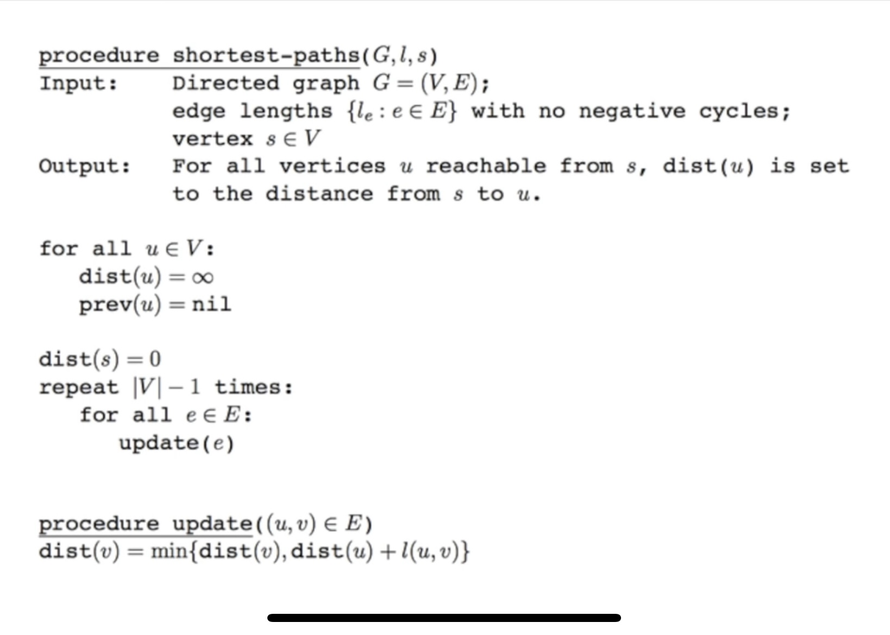

# Ch 30. 최단 경로 알고리즘

> 발표일 `24.08.23`
>
> 발표자 `이창준`

<br />

## 최단 경로 알고리즘

> 1. 가중치가 있는 그래프 위에서의 최단 경로를 찾는 것
> 2. 다양한 그래프의 종류와 특성에 따라 최적화된 많은 최단 경로 알고리즘이 존재

## 음수 간선의 중요성


## 그래프의 종류

### 단일 시작점과 모든 쌍 알고리즘

- 단일 시작점 알고리즘들은 너비 우선 탐색과 비슷하게, 하나의 시작점에서 다른 모든 정점까지 가는 최단 거리를 구해줌
- 모든 쌍 알고리즘은 모든 정점의 쌍에 대해 최단 거리를 계산

### 방향 그래프와 무방향 그래프

- 무방향 그래프의 최단 경로는 반드시 방향이 있어야만 문제가 성립이 된다

## 간선 가중치의 표기

- edge (u, v) 의 가중치를 w(u, v) 로 표기

## 다익스트라 알고리즘

- 단일 시작점 알고리즘으로, 시작 정점 s 에서부터 다른 정점들까지의 최단 거리를 계산

- bfs 와의 차이점
  

- 동작 원리
  
  
  
  
  
  
  

```python
n, m = map(int, input().split())
k = int(input())                 # 시작할 노드
INF = 1e8

graph = [[] for _ in range(n+1)] # 1번 노드부터 시작하므로 하나더 추가

visited = [False] * (n+1)
distance = [INF] * (n+1)

for _ in range(m):
  u, v, w = map(int, input().split()) # u: 출발노드, v: 도착노드, w: 연결된 간선의 가중치
  graph[u].append((v, w))             # 거리 정보와 도착노드를 같이 입력합니다.

def get_smallest_node():
  min_val = INF
  index = 0
  for i in range(1, n+1):
    if distance[i] < min_val and not visited[i]:
      min_val = distance[i]
      index = i
  return index

def dijkstra(start):
  distance[start] = 0 # 시작 노드는 0으로 초기화
  visited[start] = True

  for i in graph[start]:
    distance[i[0]] = i[1] # 시작 노드와 연결된 노도들의 거리 입력

  for _ in range(n-1):
    now = get_smallest_node() # 거리가 구해진 노드 중 가장 짧은 거리인 것을 선택
    visited[now] = True       # 방문 처리

    for j in graph[now]:
      if distance[now] + j[1] < distance[j[0]]: # 기존에 입력된 값보다 더 작은 거리가 나온다면,
        distance[j[0]]= distance[now] + j[1]    # 값을 갱신한다.

dijkstra(k)
print(distance)
```

### 우선순위 큐를 사용했을 때

```python
import heapq  # 우선순위 큐 구현을 위함

graph = {
    'A': {'B': 8, 'C': 1, 'D': 2},
    'B': {},
    'C': {'B': 5, 'D': 2},
    'D': {'E': 3, 'F': 5},
    'E': {'F': 1},
    'F': {'A': 5}
}

def dijkstra(graph, start):
  distances = {node: float('inf') for node in graph}  # start로 부터의 거리 값을 저장하기 위함
  distances[start] = 0  # 시작 값은 0이어야 함
  queue = []
  heapq.heappush(queue, [distances[start], start])  # 시작 노드부터 탐색 시작 하기 위함.

  while queue:  # queue에 남아 있는 노드가 없으면 끝
    current_distance, current_destination = heapq.heappop(queue)  # 탐색 할 노드, 거리를 가져옴.

    if distances[current_destination] < current_distance:  # 기존에 있는 거리보다 길다면, 볼 필요도 없음
      continue

    for new_destination, new_distance in graph[current_destination].items():
      distance = current_distance + new_distance  # 해당 노드를 거쳐 갈 때 거리
      if distance < distances[new_destination]:  # 알고 있는 거리 보다 작으면 갱신
        distances[new_destination] = distance
        heapq.heappush(queue, [distance, new_destination])  # 다음 인접 거리를 계산 하기 위해 큐에 삽입

  return distances
```

### 다익스트라 알고리즘의 시간 복잡도

- 크게 두가지 작업의 시간을 분석해볼 수 있음
  1. 각 정점마다 인접한 간선들을 모두 검사하는데 걸리는 시간 O(E)
  2. 우선순위 큐에 원소를 넣고 삭제 하는데 걸리는 시간
  - 큐에서 원소를 삭제 하는 작업: O(log V)
  - 큐에 원소를 추가하는 작업: O(log V)
  - 위 두 연산은 각 정점 마다 일어날 수 있으므로, 이 부분의 전체 시간 복잡도는 O(VlogV) 이다.
  - 하지만 실제로 큐에 삽입과 삭제 연산은 간선의 수 E 에 비례하는 횟수로 이루어지므로, 이 작업의 시간 복잡도는 O(ElogV) 가 된다.
  3. 떄문에 전체 시간 복잡도는 O(E) + O(ElogV) = O(ElogV)

### O(|V|logV) 다익스트라 구현하기

- pq 대신에 피보나치 힙이나 이진 검색 트리를 사용하면 가능하다는데, 이러한 자료구조는 구현이 복잡하고 실제로 구현해서 수행해봐도 더 느린 경우가 있어서 사용하진 않는다.

## 밸만포드 알고리즘

- 음수 간선이 있는 경우, 해당 알고리즘을 사용해야한다.




### 음수 사이클 판정

- 밸만 포드는 n - 1 번의 반복으로 모든 경로가 업데이트 되기 떄문에 혹시나 n 번째 반복을 했을 때, 처단거리 리슽으에 변동이 생긴다면 음수 사이클이 존재한다는 뜻이다.

### 구현

```python
import sys
input = sys.stdin.readline
INF = int(1e9) # 무한을 의미하는 값으로 10억을 설정

# 노드의 개수, 간선의 개수를 입력받기
n, m = map(int, input().split())
# 모든 간선에 대한 정보를 담는 리스트 만들기
edges = []
# 최단 거리 테이블을 모두 무한으로 초기화
distance = [INF] * (n + 1)

# 모든 간선 정보를 입력받기
for _ in range(m):
    a, b, c = map(int, input().split())
    # a번 노드에서 b번 노드로 가는 비용이 c라는 의미
    edges.append((a, b, c))

def bf(start):
    # 시작 노드에 대해서 초기화
    distance[start] = 0
    # 전체 n - 1번의 라운드(round)를 반복
    for i in range(n):
        # 매 반복마다 "모든 간선"을 확인하며
        for j in range(m):
            cur_node = edges[j][0]
            next_node = edges[j][1]
            edge_cost = edges[j][2]
            # 현재 간선을 거쳐서 다른 노드로 이동하는 거리가 더 짧은 경우
            if distance[cur_node] != INF and distance[next_node] > distance[cur_node] + edge_cost:
                distance[next_node] = distance[cur_node] + edge_cost
                # n번째 라운드에서도 값이 갱신된다면 음수 순환이 존재
                if i == n - 1:
                    return True
    return False

# 벨만 포드 알고리즘을 수행
negative_cycle = bf(1) # 1번 노드가 시작 노드

if negative_cycle:
    print("-1")
else:
    # 1번 노드를 제외한 다른 모든 노드로 가기 위한 최단 거리를 출력
    for i in range(2, n + 1):
        # 도달할 수 없는 경우, -1을 출력
        if distance[i] == INF:
            print("-1")
        # 도달할 수 있는 경우 거리를 출력
        else:
            print(distance[i])
```

### 밸만포드 알고리즘의 시간복잡도

- O(|V||E|)

## 플로이드 워샬의 모든 쌍 최단거리 알고리즘

- 한 시작점에서의 최단거리 뿐만 아니라, 모든 정점 쌍에 대해 최단거리를 구해야 할 때 사용


### 구현

```python
import sys
input = sys.stdin.readline

n = int(input())
v = int(input())
INF = 9999999
graph = [[INF] * (n+1) for _ in range(n+1)]

for _ in range(v) :
    v1, v2, c = map(int, input().split())
    graph[v1][v2] = c

for i in range(1, n+1) :
    graph[i][i] = 0

for k in range(1, n+1) :
    for i in range(1, n+1) :
        for j in range(1, n+1) :
            graph[i][j] = min(graph[i][j], graph[i][k] + graph[k][j])


for i in range(1, n+1) :
    for j in range(1, n+1) :
        if graph[i][j] == INF :
            print("0", end=" ")
        else :
            print(graph[i][j], end=" ")
    print()
```

### 플로이드 워샬 알고리즘의 시간 복잡도

- O(|V|^3)

## 출처

### 사진

- (youtube)[https://www.youtube.com/@MichaelSambol]

### 코드

- (다이스트라)[https://justkode.kr/algorithm/python-dijkstra/]
- (밸만포드)[https://headf1rst.github.io/algorithm/bellmanford/]
- (플로이드 워셜)[https://velog.io/@dltmdrl1244/%EC%95%8C%EA%B3%A0%EB%A6%AC%EC%A6%98-%ED%94%8C%EB%A1%9C%EC%9D%B4%EB%93%9C-%EC%99%80%EC%83%ACFloyd-Warshall-%EC%95%8C%EA%B3%A0%EB%A6%AC%EC%A6%98-%ED%8C%8C%EC%9D%B4%EC%8D%AC]
