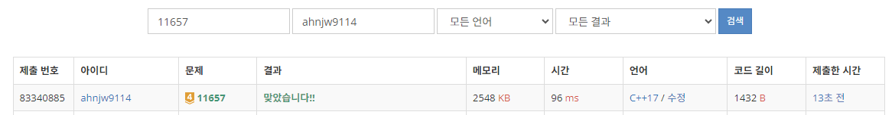

- [백준 11657번 타임머신](https://www.acmicpc.net/problem/11657)

  - [소스코드](./11657.cpp)

- [1334. Find the City WIth the Smallest number of Heighbors at a Threshold Distance](https://leetcode.com/problems/find-the-city-with-the-smallest-number-of-neighbors-at-a-threshold-distance/description/)

  - [소스코드](./1334.cpp)

