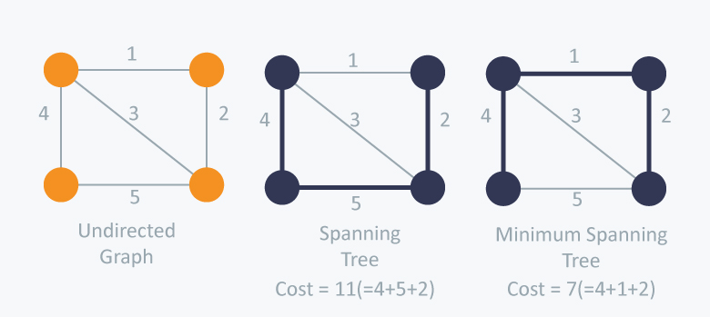
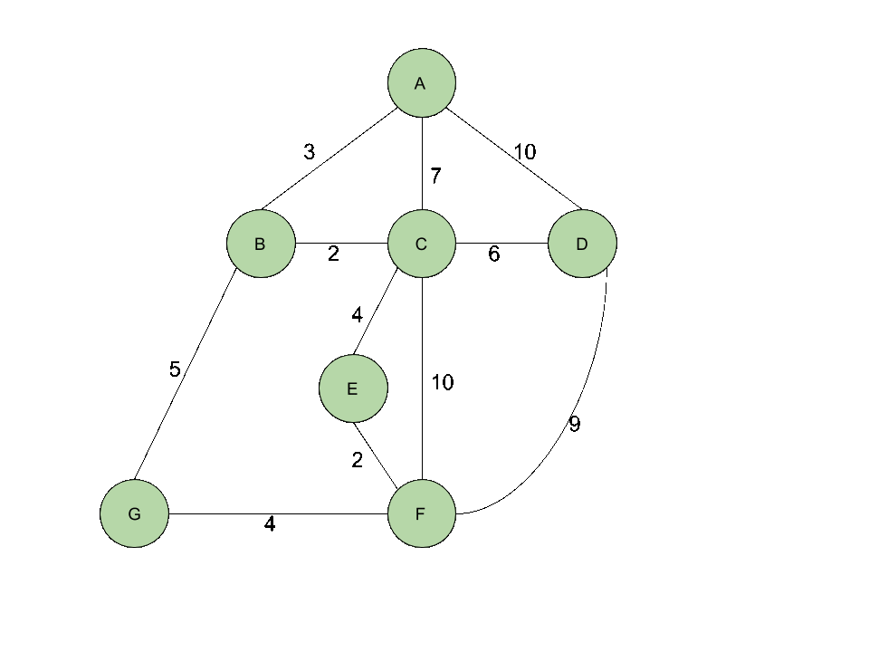
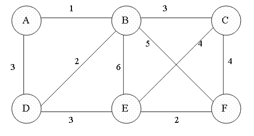

# Ch 31. 최소 스패닝 트리

> 발표일 `24.09.06`
>
> 발표자 `한태혁`


## 스패닝 트리 (신장 트리)

- 그래프의 모든 정점을 포함하지만, 사이클이 없는 트리

## 최소 스패닝 트리

- 가중치 그래프의 스패닝 트리 중 가중치의 합이 가장 작은 트리



# 크루스칼 알고리즘 

- 그래프의 모든 간선을 
    1. 가중치의 오름차순으로 정렬
    2. 가중치가 작은 간선부터 스패닝 트리에 하나씩 추가
    3. 사이클이 생기는 간선은 제외



구현 코드

``` cpp
// 트리를 이용해 상호 배제적 집합을 구현한다.
struct DisjointSet {
  vector<int> parent, rank;

  DisjointSet(int n) : parent(n), rank(n, 1) {
    for(int i = 0; i < n; i++)
      parent[i] = i;
  }

  // u 가 속한 트리의 루트의 번호를 반환한다
  int find(int u) {
    if(u == parent[u]) return u;
    return parent[u] = find(parent[u]);
  }

  // u 가 속한 트리와 v 가 속한 트리를 합친다
  void merge(int u, int v) {
    u = find(u); v = find(v);
    // 이미 둘이 같은 트리에 속한 경우
    if(u == v) return;
    if(rank[u] > rank[v]) swap(u, v);
    // 이제 항상 rank[v] 가 더 크므로 u 를 v 의 자식으로 넣는다
    if(rank[u] == rank[v]) rank[v]++;
    parent[u] = v;
  }
};

const int MAX_V = 100;
const int INF = 987654321;

// 정점의 개수
int V;
// 그래프의 인접 리스트. (연결된 정점 번호, 간선 가중치) 쌍을 담는다.
vector<pair<int,int> > adj[MAX_V];

// 주어진 그래프에 대해 최소 스패닝 트리에 포함된 간선의 목록을 selected에 저장하고, 가중치의 합을 반환한다.
int kruskal(vector<pair<int,int> >& selected) {
  int ret = 0;
  selected.clear();

  // (가중치, (정점1, 정점2)) 의 목록을 얻는다
  vector<pair<int,pair<int,int> > > edges;
  for(int u = 0; u < V; ++u)
    for(int i = 0; i < adj[u].size(); ++i) {
      int v = adj[u][i].first, cost = adj[u][i].second;
      edges.push_back(make_pair(cost, make_pair(u, v)));
    }
  // 가중치 순으로 정렬
  sort(edges.begin(), edges.end());

  // 처음엔 모든 정점이 서로 분리되어 있다
  DisjointSet sets(V);
  for(int i = 0; i < edges.size(); ++i) {
    // 간선 (u,v) 를 검사한다
    int cost = edges[i].first;
    int u = edges[i].second.first, v = edges[i].second.second;
    // 이미 u와 v가 연결되어 있을 경우 무시한다
    if(sets.find(u) == sets.find(v)) continue;
    // 이 둘을 합친다
    sets.merge(u, v);
    selected.push_back(make_pair(u, v));
    ret += cost;
  }
  return ret;
}
```

Disjoint 연산은 상수 시간에 가깝기 때문에 트리를 만드는 for문의 시간 복잡도 = O(E) \
**크루스칼 알고리즘 시간 복잡도: O(ElogE)** = 간선 목록 정렬 복잡도

<br>

## 프림 알고리즘

- 하나의 시작점으로 구성된 트리에
    1. 인접한 간선 중 가중치가 가장 작은 간선을 하나씩 추가
    2. 사이클이 생기는 간선은 제외



구현 코드

``` cpp
const int MAX_V = 100;
const int INF = 987654321;

// 정점의 개수
int V;
// 그래프의 인접 리스트. (연결된 정점 번호, 간선 가중치) 쌍을 담는다.
vector<pair<int,int> > adj[MAX_V];

// 주어진 그래프에 대해 최소 스패닝 트리에 포함된 간선의 목록을 selected에  저장하고, 가중치의 합을 반환한다.
int prim(vector<pair<int,int> >& selected) {

  selected.clear();

  // 해당 정점이 트리에 포함되어 있나?
  vector<bool> added(V, false);
  // 트리에 인접한 간선 중 해당 정점에 닿는 최소 간선의 정보를 저장한다.
  vector<int> minWeight(V, 987654321), parent(V, -1);

  // 가중치의 합을 저장할 변수
  int ret = 0;

  // 0번 정점을 시작점으로: 항상 트리에 가장 먼저 추가한다
  minWeight[0] = parent[0] = 0;

  for(int iter = 0; iter < V; ++iter) {
    // 다음에 트리에 추가할 정점 u를 찾는다
    int u = -1;
    for(int v = 0; v < V; ++v)
      if(!added[v] && (u == -1 || minWeight[u] > minWeight[v]))
        u = v;
    // (parent[u], u) 를 트리에 추가한다
    if(parent[u] != u)
      selected.push_back(make_pair(parent[u], u));
    ret += minWeight[u];
    added[u] = true;
    // u 에 인접한 간선 (u,v)들을 검사한다
    for(int i = 0; i < adj[u].size(); ++i) {
      int v = adj[u][i].first, weight = adj[u][i].second;
      if(!added[v] && minWeight[v] > weight) {
        parent[v] = u;
        minWeight[v] = weight;
      }
    }
  }
  return ret;
}
```
프림 알고리즘 시간 복잡도 = O(V^2) = 매 정점마다 새 정점을 찾는 작업의 시간 복잡도
거의 모든 정점들 사이에 간선이 있는 밀집 그래프의 경우 |E| ≈ |V|^2 
=> 밀집 그래프에 가까울수록 프림 알고리즘이 크루스칼 알고리즘보다 빠르게 동작

\+ 배열이 아닌 우선순위 큐 사용
``` cpp
// STL implementation of Prim's algorithm for MST
#include<bits/stdc++.h>
using namespace std;
# define INF 0x3f3f3f3f

// iPair ==> Integer Pair
typedef pair<int, int> iPair;

// This class represents a directed graph using
// adjacency list representation
class Graph
{
	int V; // No. of vertices

	// In a weighted graph, we need to store vertex
	// and weight pair for every edge
	list< pair<int, int> > *adj;

public:
	Graph(int V); // Constructor

	// function to add an edge to graph
	void addEdge(int u, int v, int w);

	// Print MST using Prim's algorithm
	void primMST();
};

// Allocates memory for adjacency list
Graph::Graph(int V)
{
	this->V = V;
	adj = new list<iPair> [V];
}

void Graph::addEdge(int u, int v, int w)
{
	adj[u].push_back(make_pair(v, w));
	adj[v].push_back(make_pair(u, w));
}

// Prints shortest paths from src to all other vertices
void Graph::primMST()
{
	// Create a priority queue to store vertices that
	// are being primMST. This is weird syntax in C++.
	// Refer below link for details of this syntax
	// https://www.geeksforgeeks.org/implement-min-heap-using-stl/
	priority_queue< iPair, vector <iPair> , greater<iPair> > pq;

	int src = 0; // Taking vertex 0 as source

	// Create a vector for keys and initialize all
	// keys as infinite (INF)
	vector<int> key(V, INF);

	// To store parent array which in turn store MST
	vector<int> parent(V, -1);

	// To keep track of vertices included in MST
	vector<bool> inMST(V, false);

	// Insert source itself in priority queue and initialize
	// its key as 0.
	pq.push(make_pair(0, src));
	key[src] = 0;

	/* Looping till priority queue becomes empty */
	while (!pq.empty())
	{
		// The first vertex in pair is the minimum key
		// vertex, extract it from priority queue.
		// vertex label is stored in second of pair (it
		// has to be done this way to keep the vertices
		// sorted key (key must be first item
		// in pair)
		int u = pq.top().second;
		pq.pop();
		
		//Different key values for same vertex may exist in the priority queue.
		//The one with the least key value is always processed first.
		//Therefore, ignore the rest.
		if(inMST[u] == true){
			continue;
		}
	
		inMST[u] = true; // Include vertex in MST

		// 'i' is used to get all adjacent vertices of a vertex
		list< pair<int, int> >::iterator i;
		for (i = adj[u].begin(); i != adj[u].end(); ++i)
		{
			// Get vertex label and weight of current adjacent
			// of u.
			int v = (*i).first;
			int weight = (*i).second;

			// If v is not in MST and weight of (u,v) is smaller
			// than current key of v
			if (inMST[v] == false && key[v] > weight)
			{
				// Updating key of v
				key[v] = weight;
				pq.push(make_pair(key[v], v));
				parent[v] = u;
			}
		}
	}
}
```
1. 각 정점이 한 번씩 우선순위 큐에서 꺼내짐 = O(VlogV)
2. 각 간선이 최대 한 번씩 우선순위 큐에 삽입 = O(ElogV)

우선순위 큐 프림 알고리즘 시간 복잡도 = O((V+E)logV) = O(ElogV)
