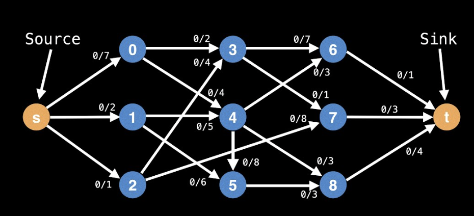
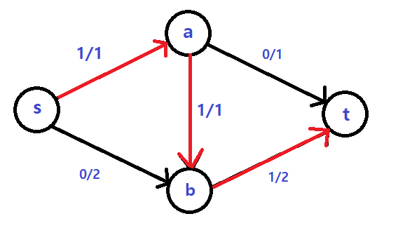
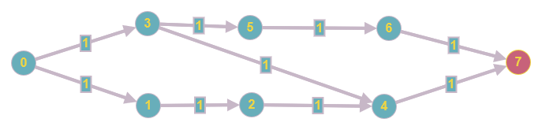
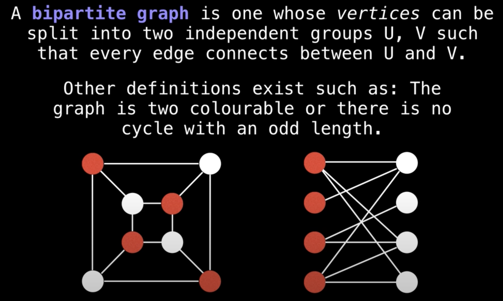
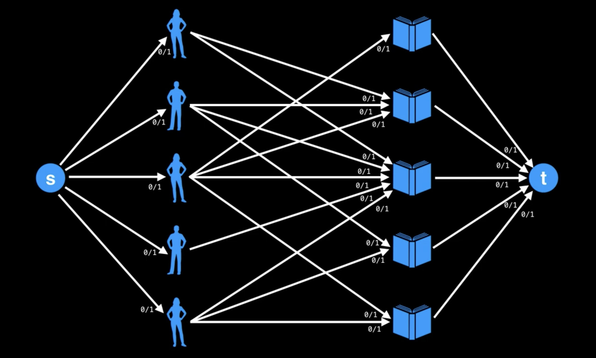
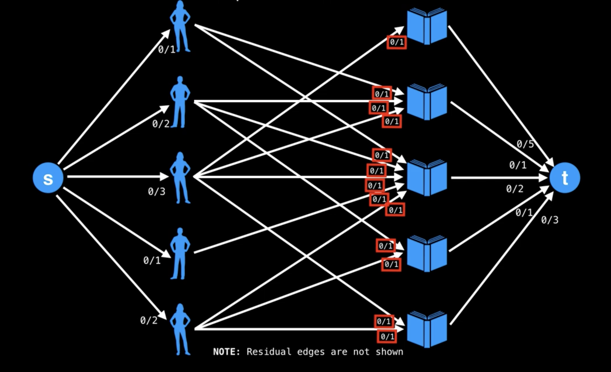

# Ch 32. 네트워크 유량

> 발표일 `24.09.13`
>
> 발표자 `정준우`

</br>

## Network Flow Algorithm



- 정의 
  - 그래프에서 두 정점 사이에 얼마나 많은 유량을 보낼 수 있는 지 계산하는 알고리즘
</br>
</br>

- 용어
  - 용량(Capacity): `c(u, v)`는 정점 u에서 v로 가는 간선의 용량(가중치)
    
  - 유량(Flow): `f(u, v)`는 정점 u에서 v로의 간선에 실제로 흐르는 유량

  - 잔여 용량(Residual Capacity): 간선의 용량과 유량의 차이.  `r(u, v) = c(u, v) - f(u, v)` 즉, 해당 간선에 추가적으로 더 흘려 보낼 수 있는 유량.

  - 소스(source): 유량이 시작되는 정점으로 모든 유량은 소스에서 부터 싱크로 흐름

  - 싱크(sink): 모든 유량이 도착하는 정점이 싱크. 네트워크 유량 알고리즘은 소스에서 싱크로 흐를 수 있는 최대 유량을 계산.

  - 용량 제한 속성: `f(u, v) <= c(u, v)`
    - 가장 자명한 속성으로, 각 간선의 유량은 해당 간선의 용량을 초과할 수 없음
  - 유량의 대칭성: `f(u, v) = -f(v, u)`
    - u에서 v로 유량이 흘러올 경우, v의 입장에서는 u로 음수의 유량을 보내는 것이라고 볼 수 있음
  - 유량의 보존: `∑f(u,v) = 0`
    - 각 정점에 들어오는 유량과 나가는 유량의 양은 같음.
    - 유량의 대칭성에 의해 정점에 들어오는 유량은 모두 음수로 표현되므로 한 정점에서 다른 모든 정점에 보내는 유량을 합하면 모두 0 이 되어야함.

- 방법
    ```bash
    1. 초기에는 최대 용량을 0으로 설정
    2. BFS 알고리즘을 사용하여 시작 노드에서 도착 노드까지의 경로 탐색
    3. 경로에서 최소 용량 탐색
    4. 경로 상의 각 간선에 대해 최소 용량을 빼고, 그 값으로 최대 용량에 가산
    5. 2번부터 4번까지 반복
    ```


## Ford Fulkerson Algorithm
```python
MAX = 1e9

def fordFulkerson(graph, s, t, n): 
    # graph는 그래프. 간선의 비용 정보
    # s는 시작 노드
    # t는 도착 노드 
    # n은 노드의 개수
    remain=[[0] * n for _ in range(n)]
    for i in range(n):
        for j in range(n):
            remain[i][j] = graph[i][j]
    max_flow = 0 # 최대 유량
    while True:
        # bfs 시작 
        ####################################
        visited = [False]*n
        queue = deque()
        queue.append(s)
        visited[s] = True
        path = [-1] * n # 경로. 부모 노드를 저장. 거슬러 올라가면 경로 구할 수 있음
        path[s] = -1 # 처음 노드는 부모 노드가 없음
        while queue:
            a = queue.popleft()
            for b in range(n):
                if not visited[b] and remain[a][b] > 0: # 방문하지 않았고 갈 수 있다면
                    queue.append(b)
                    path[b] = a # 부모 노드 저장
                    visited[b] = True
        if not visited[t]: # 목적지로 가는 경로가 없다면
            break
        # bfs 끝. 경로는 도착 노드인 t 부터 path를 보면서 부모 노드를 거슬러 올라가면 됨
        #####################################

        print(path)

        b = t # 경로를 거슬러 올라가기 위한 변수
        min_remain = MAX # 경로 간선들 중 가장 작은 용량을 구하기 위한 변수
        while b != s: # 처음 노드에 도착할 때까지
            a = path[b]
            min_remain=min(min_remain, remain[a][b]) 
            b = a
            
        b = t
        while b != s:
            a = path[b]
            remain[a][b] -= min_remain
            remain[b][a] += min_remain
            b = a
        max_flow += min_remain
    return max_flow
```

## 과연 reverse residual이 언제 쓰일까?

1. DFS의 경우 </br> </br>

</br>
</br>
</br>
</br>
2. BFS의 경우 </br> 

</br>
</br>
</br>
</br>

## Bipartite Matching </br>
 </br>
 </br>
 </br>
